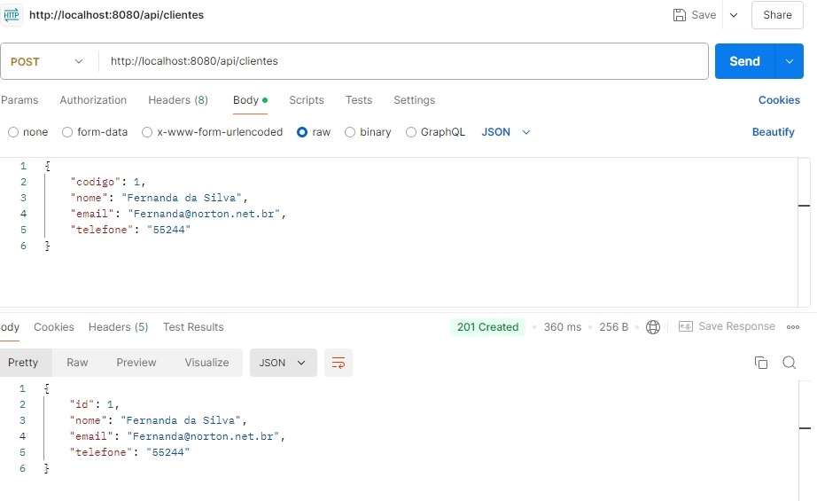
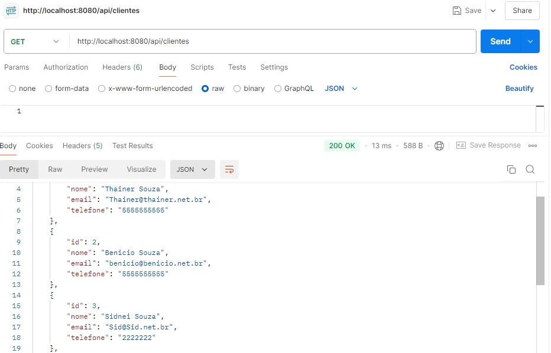
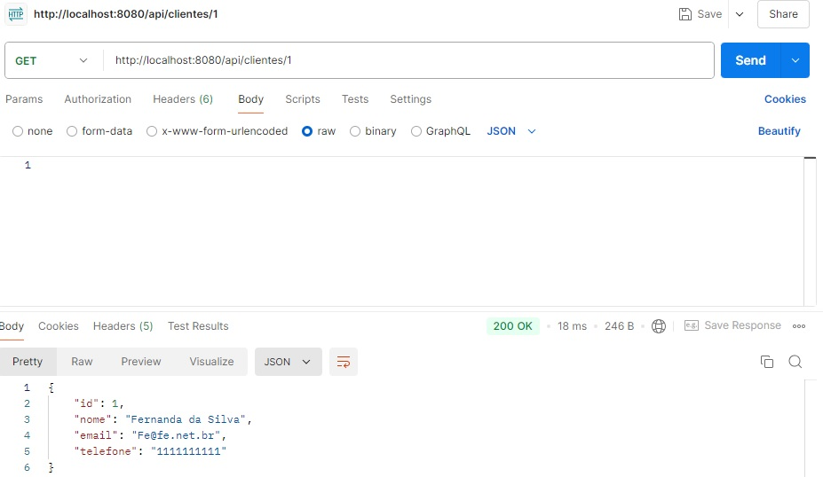
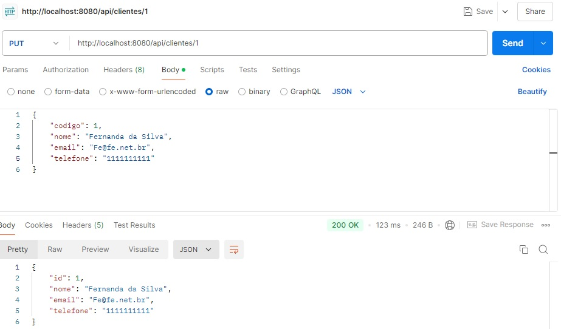
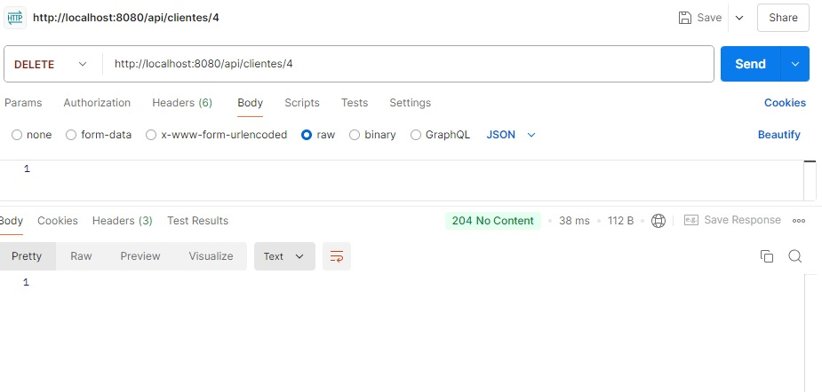

# CRUD de Clientes

Este projeto oferece um CRUD (Create, Read, Update, Delete) simples para gerenciar clientes.

## Funcionalidades

- **Cadastro de clientes**
- **Listagem de clientes**
- **Busca de clientes**
- **Atualização de clientes**
- **Exclusão de clientes**

## Testando com Postman

Aqui estão algumas capturas de tela de como testar o CRUD de Clientes utilizando o Postman:


### 1. Criando um Cliente



### 2. Buscando Clientes



### 3. Buscando Clientes por id



### 4. Buscando Clientes por id


### 5. Alterando Clientes



### 6. Deletando Clientes


## Como Rodar o Projeto

## Tecnologias

- Java
- Spring Boot
- MySQL

### Como Rodar o Projeto

1. Clone o repositório:
   ```bash
   git clone https://github.com/osidsouza/support.git
